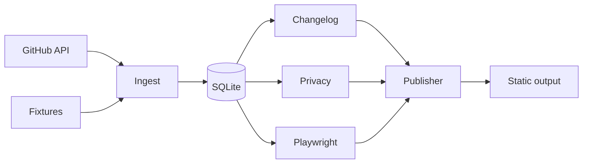

# EngineerProfile

EngineerProfile builds a local engineering portfolio from public repository evidence.
It stores repository metadata, commits, releases, privacy choices, and preview paths in SQLite.
It publishes a static site from those records.

## Value

- Keep portfolio facts close to their source data.
- Refresh project cards from public GitHub repositories.
- Build release notes from releases or conventional commits.
- Capture repeatable project previews with Playwright.
- Hide projects and redact author emails before publication.
- Inspect every ingest, capture, and publish operation.

The first release runs without secrets.
The fixture demo needs no network access.

## Architecture



| Area | Responsibility |
| --- | --- |
| `src/ingest/` | Fetch public GitHub data and map it to records. |
| `src/db/` | Store projects, commits, changelogs, and audit events. |
| `src/changelog/` | Prefer release notes and fall back to commit groups. |
| `src/privacy/` | Hide projects and block sensitive commit messages. |
| `src/preview/` | Capture fixed viewport screenshots with Playwright. |
| `src/publish/` | Render HTML, changelog files, and preview assets. |
| `fixtures/` | Provide deterministic demo data and local preview pages. |

## Setup

Use Node.js 20 or newer.

```bash
npm ci
npx playwright install chromium
npm run demo
```

Open `output/index.html` in a browser.

The demo creates a local SQLite database under `data/`.
It writes the static site under `output/`.
Both directories are ignored by Git.

## Sample output

The fixture set contains `signal-router` and `metrics-kit`.
The first project has release notes.
The second project uses commit-based notes.

```text
Ingested 2 fixture projects.
Captured demo-engineer-signal-router.
Captured demo-engineer-metrics-kit.
Published 2 projects to output/index.html.
Copied 2 available preview screenshots.
Open output/index.html in a browser.
```

The site shows project facts, source links, changelog previews, and screenshots.
The totals come from fixture fields and stored commit records.

## Commands

Build before direct CLI commands.

| Command | Result |
| --- | --- |
| `npm run demo` | Run the complete local fixture pipeline. |
| `npm run ingest -- demo-engineer --fixture` | Load fixture records only. |
| `npm run ingest -- octocat --limit 3` | Ingest up to three public repositories. |
| `npm run capture -- --fixture` | Capture local fixture pages. |
| `npm run publish` | Rebuild the site from SQLite. |
| `node dist/index.js status` | Show visibility and recent operations. |
| `npm test` | Run deterministic unit and integration tests. |
| `npm run typecheck` | Validate TypeScript types. |
| `npm run build` | Compile the CLI to `dist/`. |

GitHub ingestion uses the public API.
Set `GITHUB_TOKEN` for a higher rate limit.

```powershell
$env:GITHUB_TOKEN="your-token"
npm run ingest -- octocat --limit 3
```

Do not put a token in repository files.
Use `.env.example` as a variable reference.

## Privacy controls

Hide a project before publishing.

```bash
node dist/index.js privacy --hide demo-engineer-metrics-kit
npm run publish
```

Show the project again with `privacy --show`.
Hidden projects remain in SQLite.
Hidden projects stay out of public HTML and copied assets.
Author emails are redacted by default.
Sensitive commit messages are skipped before storage.

## Audit model

Each project stores a repository URL and its last pushed timestamp.
Each stored commit keeps its SHA, message first line, date, and source URL.
Each release keeps its tag, notes, date, and source URL.

The site displays visible projects only.
It links project cards to repositories.
It links release notes to their release pages.
It records local operations in an audit table.

## Evaluation evidence

The test suite covers these core behaviors:

- Conventional commit parsing.
- Release-first changelog generation.
- SQLite upserts and changelog replacement.
- Privacy filtering and email redaction.
- Fixture ingestion and static publishing.
- Release source links.
- Deterministic HTML output.
- Playwright screenshot capture.

CI runs typecheck, build, tests, the fixture demo, and artifact upload.

```bash
npm run typecheck
npm run build
npm test
```

## Test status

`npm run typecheck` passes.
`npm run build` passes.
`npm test` runs the full suite.
CI runs the same checks on Ubuntu with Chromium installed.

## Limitations

- GitHub ingestion needs network access.
- Public API calls have rate limits without a token.
- Capture needs a local Chromium installation.
- Changelog quality depends on releases or conventional commits.
- Publishing creates local files. It does not deploy them.
- The first release does not schedule refreshes.

## Roadmap

| Release | Scope |
| --- | --- |
| v0.1 | Fixture demo, GitHub ingest, changelog, capture, publish, and privacy controls. |
| v0.2 | Scheduled refresh and a checked-in configuration file. |
| v0.3 | Custom themes and deployment adapters. |
| v0.4 | Commit-diff summaries and an RSS feed. |

## License

MIT. See [LICENSE](LICENSE).