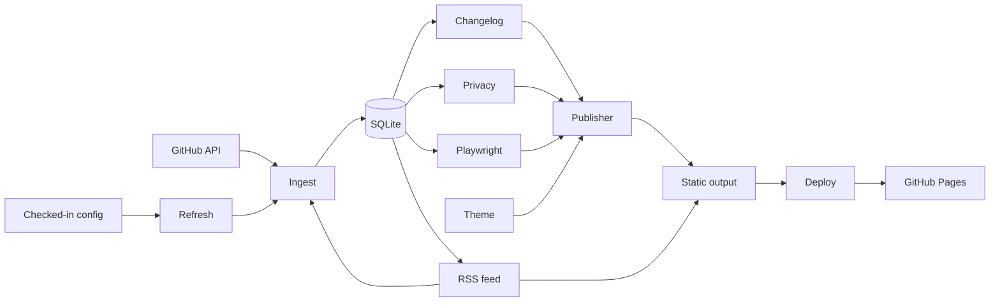

# EngineerProfile

EngineerProfile builds a local engineering portfolio from public repository data.
It stores repository metadata, commits, releases, privacy settings, and preview paths in SQLite.
It publishes a static site from these records.

## Value

- Keep portfolio facts close to their source data.
- Refresh project cards from public GitHub repositories.
- Build release notes from releases or conventional commits.
- Capture repeatable project previews with Playwright.
- Hide projects and redact author emails before publication.
- Choose a built-in theme or supply your own CSS.
- Surface commit-diff totals on every project card.
- Publish an RSS feed of release and commit signals.
- Stage the site for GitHub Pages deployment.
- Run one configured refresh from a scheduled workflow.

The fixture demo runs without secrets and without network access.

## Architecture



| Area | Responsibility |
| --- | --- |
| `engineer-profile.config.json` | Store owner, presentation, theme, refresh, deployment, paths, and privacy settings. |
| `src/config/` | Validate checked-in JSON and merge safe defaults. |
| `src/refresh/` | Coordinate ingest, best-effort capture, static publishing, and deployment staging. |
| `src/ingest/` | Fetch public GitHub data and map it to records. |
| `src/db/` | Store projects, commits, changelogs, and audit events. |
| `src/changelog/` | Prefer release notes and fall back to commit groups. |
| `src/privacy/` | Hide projects and block sensitive commit messages. |
| `src/preview/` | Capture fixed viewport screenshots with Playwright. |
| `src/theme/` | Provide built-in themes and merge custom CSS. |
| `src/feed/` | Render a deterministic RSS feed from changelog entries. |
| `src/publish/` | Render HTML, changelog files, and preview assets. |
| `src/deploy/` | Stage the published site for a deployment platform. |
| `fixtures/` | Provide deterministic demo data and local preview pages. |

The refresh command runs each stage in a fixed order.
If a preview fails, the command reports the skip and keeps the rest of the snapshot.

## Setup

Use Node.js 22 or newer.

```bash
npm ci
npx playwright install chromium
npm run demo
```

Open `output/index.html` in a browser.

The demo creates a local SQLite database under `data/`.
It writes the static site under `output/`.
Both directories are ignored by Git.

## Configuration

`engineer-profile.config.json` is the checked-in source for scheduled refreshes.
It sets the GitHub owner, site presentation, repository limit, paths, privacy controls, and feed settings.

The loader accepts repository limits from 1 through 100.
It rejects malformed values before network access.
CLI `--config`, `--data`, and `--output` options override file values.

Run a network-backed refresh with the checked-in settings:

```bash
npm run refresh
```

The refresh command reads public repositories, captures previews, publishes HTML,
and reports skipped captures.

GitHub ingestion uses the public API.
Set `GITHUB_TOKEN` for a higher rate limit.

```powershell
$env:GITHUB_TOKEN="your-token"
npm run refresh
```

Do not put a token in repository files.
Use `.env.example` as a variable reference.

## Themes

The site uses a theme for presentation.
Pick a theme by name in the config file.
Run `npm run themes` to list the built-in themes.

The default theme is `midnight`.

| Theme | Appearance |
| --- | --- |
| `midnight` | Dark interface with blue and mint accents. |
| `paper` | Light interface with serif type and warm paper tones. |
| `terminal` | Monospace interface inspired by a terminal emulator. |

Set the theme by name:

```json
{ "theme": "paper" }
```

Set a custom theme with an object:

```json
{ "theme": { "name": "studio", "customCss": "themes/studio.css" } }
```

The loader rejects unknown theme names unless you provide a custom CSS file.
The publisher appends your CSS after the built-in stylesheet.
Use CSS variables to override the base palette and fonts.
Start from a built-in theme, then override the variables you need.

## Deployment

`engineer-profile` can stage a site for GitHub Pages.
Set the deployment platform in the config file.
The publisher writes a `.nojekyll` file for GitHub Pages.
It writes a `CNAME` file when you configure a custom domain.

```json
{
  "deployment": {
    "platform": "github-pages",
    "cname": "engineering.example.com"
  }
}
```

Stage the published site with a command:

```bash
npm run deploy
```

The `deploy` workflow publishes the site to GitHub Pages.
It runs on a schedule and on manual dispatch.
Enable the Pages feature in the repository settings first.
The workflow does not manage repository settings.

## RSS feed

The publisher writes an RSS feed at publish time.
The feed contains the latest changelog entry for each visible project.
Entries link back to their release pages or commit records.

Set the feed channel in the config file:

```json
{
  "feed": {
    "enabled": true,
    "limit": 20,
    "description": "Release notes from public repositories.",
    "siteUrl": "https://engineering.example.com"
  }
}
```

The feed is enabled by default.
The limit caps the number of items.
The description falls back to the portfolio tagline.
The site URL sets the canonical channel link.
Without a site URL, the publisher uses the deployment domain or the repository homepage.

Feed output is deterministic.
The same snapshot produces the same `feed.xml`.
The page head links to the feed with an `alternate` tag.

## Sample output

The fixture set contains `signal-router` and `metrics-kit`.
The first project has release notes.
The second project uses commit-based notes.

```text
Ingested 2 fixture projects.
Captured demo-engineer-signal-router.
Captured demo-engineer-metrics-kit.
Published 2 projects to output/index.html.
Copied 2 available preview screenshots.
Wrote output/feed.xml with 2 entries.
Open output/index.html in a browser.
```

The site shows project facts, source links, changelog previews, screenshots, and diff totals.
The totals come from fixture fields and stored commit records.

With GitHub Pages configured, the deploy command adds one line:

```text
Published 2 projects to output/index.html.
Copied 2 available preview screenshots.
Wrote output/feed.xml with 2 entries.
Staged .nojekyll for github-pages.
```

## Commands

Build before direct CLI commands.

| Command | Result |
| --- | --- |
| `npm run demo` | Run the complete fixture pipeline. |
| `npm run ingest -- octocat --limit 3` | Load public repository evidence. |
| `npm run ingest -- --fixture` | Load fixture records only. |
| `npm run capture -- --fixture` | Capture local fixture pages. |
| `npm run publish` | Rebuild the site and RSS feed from SQLite. |
| `npm run deploy` | Publish, write the feed, and stage deployment files. |
| `npm run themes` | List built-in themes. |
| `npm run refresh` | Run configured ingest, capture, publish, and feed stages. |
| `node dist/index.js status` | Show visibility and recent operations. |
| `npm test` | Run deterministic unit and integration tests. |
| `npm run typecheck` | Validate TypeScript types. |
| `npm run build` | Compile the CLI to `dist/`. |

## Privacy controls

Hide a project before publishing.

```bash
node dist/index.js privacy --hide demo-engineer-metrics-kit
npm run publish
```

Show the project again with `privacy --show`.
Hidden projects remain in SQLite.
Hidden projects stay out of public HTML and copied assets.
Author emails are redacted by default.
Sensitive commit messages are skipped before storage.

## Audit model

Each project stores a repository URL and its last pushed timestamp.
Each stored commit keeps its SHA, message first line, date, and source URL.
Each stored commit also keeps its line additions, line deletions, change total, and file count.
Each release keeps its tag, notes, date, and source URL.

The site shows the commit diff totals on each project card.
Commit-based changelog bullets carry per-commit diff markers.

The site displays visible projects only.
It links project cards to repositories.
It links release notes to their release pages.
It records local operations in an audit table.

## CI and test status

The regular CI workflow runs typecheck, build, tests, the fixture demo, and artifact upload.
It runs on Node.js 22.
The scheduled refresh workflow runs each Monday and supports manual dispatch.
It uploads the generated site as a workflow artifact.
The deploy workflow publishes the site to GitHub Pages.
Tests run in a single forked process.
This keeps native modules and Playwright stable on shared runners.

The test suite covers these core behaviors:

- Configuration validation and default merging.
- Conventional commit parsing.
- Release-first changelog generation.
- SQLite upserts and changelog replacement.
- Privacy filtering and email redaction.
- Theme resolution and custom CSS overlays.
- Deployment staging for GitHub Pages.
- Commit diff totals and per-commit diff markers.
- Deterministic RSS feed output.
- Fixture ingestion and static publishing.
- Configured refresh orchestration.
- Release source links.
- Deterministic HTML output.
- Playwright screenshot capture.

Run the local checks:

```bash
npm run typecheck
npm run build
npm test
```

### Validation status

Typecheck and build pass locally.
CI runs the complete test suite on Ubuntu with Chromium installed.
The fixture pipeline provides deterministic data for repeatable checks.

## Limitations

- GitHub ingestion needs network access.
- Public API calls have rate limits without a token.
- Capture needs a local Chromium installation.
- Changelog quality depends on releases or conventional commits.
- External pages can fail during capture.
- Capture failures are reported and do not stop publishing.
- Publishing creates local files. It does not deploy them.
- Scheduled runs upload artifacts. They do not commit generated output.
- GitHub Pages deployment needs the Pages feature enabled in the repository settings.
- Custom themes must define the CSS variables the base stylesheet expects.
- Diff totals cover the tracked commit window only.
- The RSS feed contains visible projects only.
- Feed links fall back to the repository homepage without a site URL.

## Roadmap

| Release | Status | Scope |
| --- | --- | --- |
| v0.1 | Complete | Fixture demo, GitHub ingest, changelog, capture, publish, and privacy controls. |
| v0.2 | Complete | Checked-in configuration, coordinated refresh command, and scheduled artifact workflow. |
| v0.3 | Complete | Custom themes and deployment adapters. |
| v0.4 | Complete | Commit-diff summaries and an RSS feed. |
| v0.5 | Next | Project detail pages and a machine-readable JSON export. |

## License

MIT. See [LICENSE](LICENSE).
