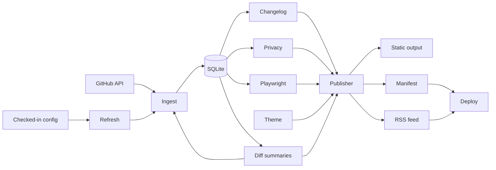
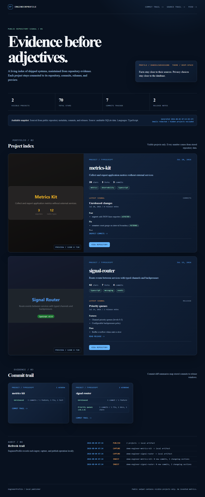
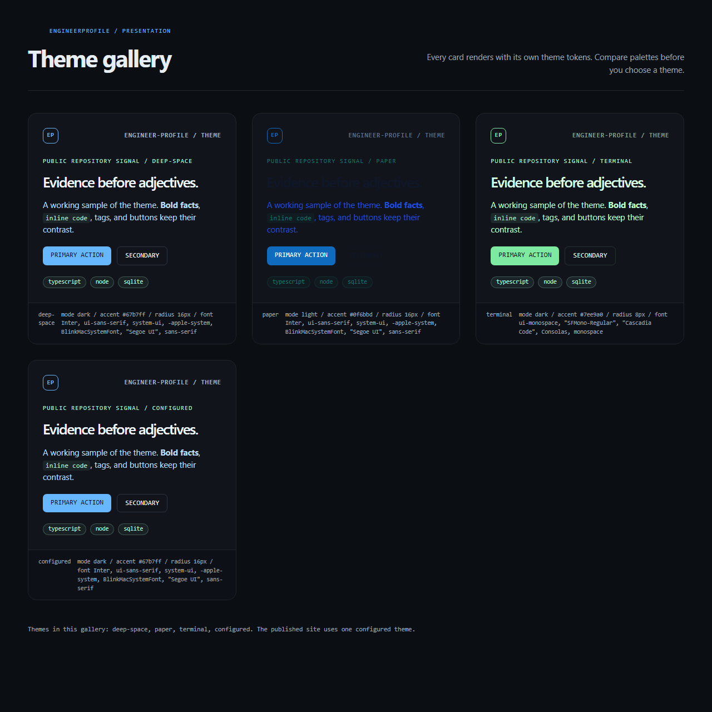

# EngineerProfile

EngineerProfile builds a local engineering portfolio from public repository data.
It stores repository metadata, commits, releases, privacy settings, and preview
paths in SQLite. It publishes a static site from these records.

## Value

- Keep portfolio facts close to their source data.
- Refresh project cards from public GitHub repositories.
- Build release notes from releases or conventional commits.
- Capture repeatable project previews with Playwright.
- Hide projects and redact author emails before publication.
- Choose a built-in theme and override accent, radius, and font.
  The published page applies every override to its CSS tokens.
- Compare every theme in a generated gallery page.
- Summarize commit activity between release windows.
- Publish an RSS feed from visible projects.
- Deploy the snapshot to configured local targets.
- Sync targets and remove stale files before verification.
- Preview local deployment changes before synchronization.
- Generate JSON deployment reports for CI and release tooling.
- Record a machine-readable manifest with every publish.
- Run one configured refresh from a scheduled workflow.

The fixture demo runs without secrets and without network access.

## Architecture



| Area | Responsibility |
| --- | --- |
| `engineer-profile.config.json` | Store owner, presentation, refresh, theme, feed, deploy, and privacy settings. |
| `src/config/` | Validate checked-in JSON and merge safe defaults. |
| `src/theme/` | Resolve built-in themes, emit CSS variables, and render a theme gallery. |
| `src/changelog/` | Prefer release notes, fall back to commit groups, and summarize commit diffs. |
| `src/refresh/` | Coordinate ingest, best-effort capture, static publishing, and deploy. |
| `src/ingest/` | Fetch public GitHub data and map it to records. |
| `src/db/` | Store projects, commits, changelogs, and audit events. |
| `src/privacy/` | Hide projects and block sensitive commit messages. |
| `src/preview/` | Capture fixed viewport screenshots with Playwright. |
| `src/publish/` | Render HTML, changelog files, commit-trail files, the theme gallery, the RSS feed, the site manifest, and preview assets. |
| `src/deploy/` | Compare snapshots, compute digests, create reports, and sync local targets. |
| `fixtures/` | Provide deterministic demo data and local preview pages. |

The refresh command runs each stage in a fixed order.
If a preview fails, the command reports the skip and keeps the rest of the snapshot.

## Setup

Use Node.js 20 or newer.

```bash
npm ci
npx playwright install chromium
npm run demo
```

Open `output/index.html` in a browser.
Open `output/theme-gallery.html` to compare the built-in themes.
Open `output/feed.xml` to inspect the RSS feed.
Run `node dist/index.js deploy --dry-run` to preview target changes.

The demo creates a local SQLite database under `data/`.
It writes the static site under `output/`.
Both directories are ignored by Git.

## Configuration

`engineer-profile.config.json` is the checked-in source for scheduled refreshes.
It sets the GitHub owner, site presentation, repository limit, paths, theme, feed, deploy, and privacy controls.

The loader accepts repository limits from 1 through 100.
It rejects malformed values before network access.
CLI `--config`, `--data`, and `--output` options override file values.

### Theme

Set the theme with a name from the built-in catalog.

```json
{
  "theme": {
    "name": "deep-space",
    "accent": "#67b7ff",
    "radius": "16px",
    "font": "Inter, system-ui, sans-serif"
  }
}
```

`name` selects a built-in theme.
`accent` sets the primary color.
`radius` sets the corner radius.
`font` sets the base font stack.
All overrides are optional.

The site applies the theme tokens to its generated CSS.
`--font` sets the base font of the page body.
`--radius` sets the corner radius of cards and panels.
The publish step writes these tokens into every generated page.

Run `node dist/index.js themes` to list the catalog.
The catalog contains `deep-space`, `paper`, and `terminal`.
The loader rejects unknown theme names and invalid accent colors.

Run `node dist/index.js themes --preview` to write a theme gallery page.
The page renders every theme with its real tokens.
It includes a `configured` card for your overrides.
Every published snapshot also contains `theme-gallery.html`.

### Feed

The publish step writes `output/feed.xml` as an RSS 2.0 document.
Each visible project becomes one feed item.
Items use the project description, the latest changelog signal, and the repository link.

Set the feed base URL for a hosted site.

```json
{
  "feed": {
    "baseUrl": "https://portfolio.example.com"
  }
}
```

Without a base URL, the feed links to `https://github.com/<owner>`.
The loader rejects feed base URLs that are not absolute http(s) URLs.

### Deploy

Deploy syncs the published output to one or more local targets.
A target must live outside the output directory.
Deploy removes stale files first, then copies the new snapshot.
It copies the snapshot, then verifies the key output files.
Each deploy records an audit entry with the file counts.
Each report records a SHA-256 digest for the source and target snapshots.

Deployment previews compare file paths and SHA-256 content hashes.
Use the dry run before a local sync.
It reports added, changed, removed, and unchanged files.
It does not create or modify the target.

Use `--json` when another tool must read the deployment result.
Preview reports include file changes and snapshot digests.
Sync reports include file counts, verification, and matching digests.

```json
{
  "deploy": {
    "targets": [
      {
        "name": "public",
        "type": "local",
        "target": "deploy/public"
      }
    ]
  }
}
```

The refresh command deploys configured targets after publishing.
Run `node dist/index.js deploy` to publish and deploy in one step.
The command reports the file count, the removed stale count, and the verification state.
Add `--json` to print a stable report instead of human-readable lines.

The report verifier prints this result:

```text
Deploy report ok: 1 target(s), mode preview.
```

Run a network-backed refresh with the checked-in settings:

```bash
npm run refresh
```

The refresh command reads public repositories, captures previews, publishes HTML,
deploys configured targets, and reports skipped captures.

GitHub ingestion uses the public API.
Set `GITHUB_TOKEN` for a higher rate limit.

```powershell
$env:GITHUB_TOKEN="your-token"
npm run refresh
```

Do not put a token in repository files.
Use `.env.example` as a variable reference.

## Sample output

The fixture set contains `signal-router` and `metrics-kit`.
The first project has release notes.
The second project uses commit-based notes.

```text
Ingested 2 fixture projects.
Captured demo-engineer-signal-router.
Captured demo-engineer-metrics-kit.
Published 2 projects to output/index.html.
Copied 2 available preview screenshots.
Wrote theme gallery to output/theme-gallery.html.
Wrote RSS feed to output/feed.xml.
Preview public: changed (0 added, 3 changed, 0 removed, 7 unchanged).
  ~ feed.xml
  ~ index.html
  ~ site-manifest.json
Open output/index.html in a browser.
```





The site shows project facts, source links, changelog previews, and screenshots.
The totals come from fixture fields and stored commit records.

The index renders a commit trail below the project cards.
The trail groups stored commits into release windows.
Each window lists its commit count and change types.
The full detail lives in `output/<slug>-changes.md`.

The demo also writes `output/site-manifest.json`.
The manifest records the theme details, project list, generated files, and the RSS feed.
The deployment report records the target path and snapshot identity.

## Commands

Build before direct CLI commands.

| Command | Result |
| --- | --- |
| `npm run demo` | Run the complete fixture pipeline. |
| `npm run ingest -- octocat --limit 3` | Load public repository evidence. |
| `npm run ingest -- --fixture` | Load fixture records only. |
| `npm run capture -- --fixture` | Capture local fixture pages. |
| `npm run publish` | Rebuild the site from SQLite. |
| `npm run gallery` | Build and write the theme gallery page. |
| `npm run refresh` | Run configured ingest, capture, publish, and deploy stages. |
| `node dist/index.js deploy` | Publish the snapshot and sync it to configured targets. |
| `node dist/index.js deploy --dry-run` | Publish the snapshot and preview target changes without syncing. |
| `node dist/index.js deploy --dry-run --json` | Print a machine-readable preview report. |
| `node dist/index.js themes` | List built-in presentation themes. |
| `node dist/index.js themes --preview` | Write a theme gallery HTML page. |
| `node dist/index.js status` | Show visibility and recent operations. |
| `npm test` | Run deterministic unit and integration tests. |
| `npm run typecheck` | Validate TypeScript types. |
| `npm run build` | Compile the CLI to `dist/`. |

Publish, refresh, and deploy write the RSS feed and commit-trail files with the snapshot.

## Privacy controls

Hide a project before publishing.

```bash
node dist/index.js privacy --hide demo-engineer-metrics-kit
npm run publish
```

Show the project again with `privacy --show`.
Hidden projects remain in SQLite.
Hidden projects stay out of public HTML and copied assets.
Author emails are redacted by default.
Sensitive commit messages are skipped before storage.

## Audit model

Each project stores a repository URL and its last pushed timestamp.
Each stored commit keeps its SHA, message first line, date, and source URL.
Each release keeps its tag, notes, date, and source URL.

The site displays visible projects only.
It links project cards to repositories.
It links release notes to their release pages.
It records local operations in an audit table.
Deploy operations keep their target name and verification state in the audit trail.

## CI and test status

The regular CI workflow runs typecheck, build, tests, the fixture demo, theme
verification, manifest verification, RSS feed verification, local deploy verification,
deployment report verification, and artifact upload.
The scheduled refresh workflow runs each Monday and supports manual dispatch.
It uploads the generated site as a workflow artifact.

The test suite covers these core behaviors:

- Configuration validation and default merging.
- Conventional commit parsing.
- Release-first changelog generation.
- Commit-diff summaries and release-window bucketing.
- RSS feed rendering, escaping, and determinism.
- SQLite upserts and changelog replacement.
- Privacy filtering and email redaction.
- Fixture ingestion and static publishing.
- Configured refresh orchestration.
- Release source links.
- Deterministic HTML, manifest, gallery, and feed output.
- Theme resolution, CSS variable emission, and gallery rendering.
- Generated CSS token application for font and radius.
- Local deploy sync, stale cleanup, and verification.
- Snapshot previews with deterministic added, changed, removed, and unchanged file lists.
- Snapshot digests and preview or sync deployment reports.
- Site manifest versioning, determinism, and theme details.
- Playwright screenshot capture.

Run the local checks:

```bash
npm run typecheck
npm run build
npm test
```

### Validation status

Typecheck and build pass locally.
The restricted Windows sandbox blocks Vitest's esbuild child process.
CI runs the full test suite on Ubuntu.
CI installs Chromium before Playwright checks.
The fixture pipeline provides deterministic data for repeatable checks.
The demo output feeds two verification scripts in CI.
They check the site manifest, the generated CSS tokens, the RSS feed, and the deployed snapshot.

## Limitations

- GitHub ingestion needs network access.
- Public API calls have rate limits without a token.
- Capture needs a local Chromium installation.
- Changelog quality depends on releases or conventional commits.
- Commit-diff windows use commit dates. Release dates set the boundaries.
- External pages can fail during capture.
- Capture failures are reported and do not stop publishing.
- Publishing creates local files. It does not deploy them.
- Themes offer built-in palettes, selected overrides, and a generated gallery.
- Local deploy syncs files. It does not push to hosts.
- Snapshot digests identify local bytes. They do not verify a remote host.
- Remote deploy adapters are not implemented.
- A dry run publishes the local snapshot before comparison.
- The RSS feed uses the configured base URL or the GitHub profile.
- Scheduled runs upload artifacts. They do not commit generated output.

## Roadmap

| Release | Status | Scope |
| --- | --- | --- |
| v0.1 | Complete | Fixture demo, GitHub ingest, changelog, capture, publish, and privacy controls. |
| v0.2 | Complete | Checked-in configuration, coordinated refresh command, and scheduled artifact workflow. |
| v0.3 | Complete | Built-in themes, theme overrides, generated CSS tokens for font and radius, theme gallery page, versioned site manifest, and local deploy sync. |
| v0.4 | Complete | Commit-diff summaries, a commit trail on the site, and an RSS feed. |
| v0.5 | Complete | Local deployment previews with deterministic file and content diffs. |
| v0.6 | Complete | Snapshot digests, JSON deployment reports, and CI report verification. |
| v0.7 | Next | Remote deploy adapters with provider-specific credentials and verification. |
| v0.8 | Later | Release brief digests and changelog archiving. |

## License

MIT. See [LICENSE](LICENSE).
