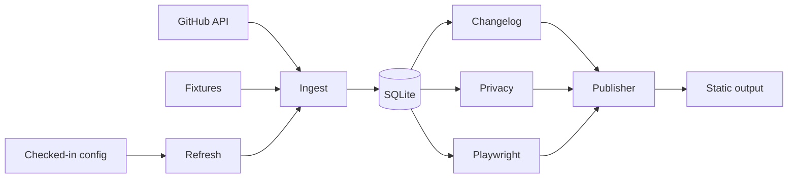

# EngineerProfile

EngineerProfile builds a local engineering portfolio from public repository data.
It stores repository metadata, commits, releases, privacy settings, and preview
paths in SQLite. It publishes a static site from these records with a named theme.

## Value

- Keep portfolio facts close to their source data.
- Refresh project cards from public GitHub repositories.
- Build release notes from releases or conventional commits.
- Capture repeatable project previews with Playwright.
- Hide projects and redact author emails before publication.
- Run one configured refresh from a scheduled workflow.

The fixture demo runs without secrets and without network access.

## Architecture



| Area | Responsibility |
| --- | --- |
| `engineer-profile.config.json` | Store owner, presentation, refresh, paths, and privacy settings. |
| `src/config/` | Validate checked-in JSON and merge safe defaults. |
| `src/refresh/` | Coordinate ingest, best-effort capture, and static publishing. |
| `src/ingest/` | Fetch public GitHub data and map it to records. |
| `src/db/` | Store projects, commits, changelogs, and audit events. |
| `src/changelog/` | Prefer release notes and fall back to commit groups. |
| `src/privacy/` | Hide projects and block sensitive commit messages. |
| `src/preview/` | Capture fixed viewport screenshots with Playwright. |
| `src/publish/site.ts` | Render HTML, changelog files, and preview assets. |
| `src/publish/themes.ts` | Register named themes and resolve presentation settings. |
| `fixtures/` | Provide deterministic demo data and local preview pages. |

The refresh command runs each stage in a fixed order.
If a preview fails, the command reports the skip and keeps the rest of the snapshot.

## Setup

Use Node.js 22 or newer.

```bash
npm ci
npx playwright install chromium
npm run demo
```

Open `output/index.html` in a browser.

The demo creates a local SQLite database under `data/`.
It writes the static site under `output/`.
Both directories are ignored by Git.

## Configuration

`engineer-profile.config.json` is the checked-in source for scheduled refreshes.
It sets the GitHub owner, site presentation, repository limit, paths, and privacy controls.

The loader accepts repository limits from 1 through 100.
It rejects malformed values before network access.
CLI `--config`, `--data`, and `--output` options override file values.

The `theme` field selects a named presentation.
Valid names are `default` and `light`.
Omit the field to use the default theme.

Run a network-backed refresh with the checked-in settings:

```bash
npm run refresh
```

The refresh command reads public repositories, captures previews, publishes HTML,
and reports skipped captures.

GitHub ingestion uses the public API.
Set `GITHUB_TOKEN` for a higher rate limit.

```powershell
$env:GITHUB_TOKEN="your-token"
npm run refresh
```

Do not put a token in repository files.
Use `.env.example` as a variable reference.

## Themes

Each theme defines the color scheme and CSS variables for the published site.
The `default` theme uses a dark palette with blue accents.
The `light` theme uses pale panels with dark text.

Build the demo in the light theme:

```bash
npm run demo -- --theme light
```

The `--theme` option works on the `demo`, `publish`, and `refresh` commands.
It overrides the theme from the configuration file.
An unknown theme name fails the command before any output is written.

## Sample output

The fixture set contains `signal-router` and `metrics-kit`.
The first project has release notes.
The second project uses commit-based notes.

```text
Ingested 2 fixture projects.
Captured demo-engineer-signal-router.
Captured demo-engineer-metrics-kit.
Published 2 projects to output/index.html.
Copied 2 available preview screenshots.
Open output/index.html in a browser.
```

The site shows project facts, source links, changelog previews, and screenshots.
The totals come from fixture fields and stored commit records.

## Commands

Build before direct CLI commands.

| Command | Result |
| --- | --- |
| `npm run demo` | Run the complete fixture pipeline. |
| `npm run demo -- --theme light` | Run the demo with the light theme. |
| `npm run ingest -- octocat --limit 3` | Load public repository evidence. |
| `npm run ingest -- --fixture` | Load fixture records only. |
| `npm run capture -- --fixture` | Capture local fixture pages. |
| `npm run publish` | Rebuild the site from SQLite. |
| `npm run refresh` | Run configured ingest, capture, and publish stages. |
| `node dist/index.js status` | Show visibility and recent operations. |
| `npm test` | Run deterministic unit and integration tests. |
| `npm run typecheck` | Validate TypeScript types. |
| `npm run build` | Compile the CLI to `dist/`. |

## Privacy controls

Hide a project before publishing.

```bash
node dist/index.js privacy --hide demo-engineer-metrics-kit
npm run publish
```

Show the project again with `privacy --show`.
Hidden projects remain in SQLite.
Hidden projects stay out of public HTML and copied assets.
Author emails are redacted by default.
Sensitive commit messages are skipped before storage.

## Audit model

Each project stores a repository URL and its last pushed timestamp.
Each stored commit keeps its SHA, message first line, date, and source URL.
Each release keeps its tag, notes, date, and source URL.

The site displays visible projects only.
It links project cards to repositories.
It links release notes to their release pages.
It records local operations in an audit table.

## CI and test status

The regular CI workflow runs typecheck, build, tests, the fixture demo, and artifact upload.
The scheduled refresh workflow runs each Monday and supports manual dispatch.
It uploads the generated site as a workflow artifact.

The test suite covers these core behaviors:

- Configuration validation and default merging.
- Conventional commit parsing.
- Release-first changelog generation.
- SQLite upserts and changelog replacement.
- Privacy filtering and email redaction.
- Fixture ingestion and static publishing.
- Configured refresh orchestration.
- Release source links.
- Deterministic HTML output.
- Theme resolution and deterministic themed publishing.
- Playwright screenshot capture.

Run the local checks:

```bash
npm run typecheck
npm run build
npm test
```

### Validation status

Typecheck and build pass locally.
CI runs the complete test suite on Ubuntu with Chromium installed.
The fixture pipeline provides deterministic data for repeatable checks.

## Limitations

- GitHub ingestion needs network access.
- Public API calls have rate limits without a token.
- Capture needs a local Chromium installation.
- Changelog quality depends on releases or conventional commits.
- External pages can fail during capture.
- Capture failures are reported and do not stop publishing.
- Publishing creates local files. It does not deploy them.
- Scheduled runs upload artifacts. They do not commit generated output.

## Roadmap

| Release | Status | Scope |
| --- | --- | --- |
| v0.1 | Complete | Fixture demo, GitHub ingest, changelog, capture, publish, and privacy controls. |
| v0.2 | Complete | Checked-in configuration, coordinated refresh command, and scheduled artifact workflow. |
| v0.3 | In progress | Named themes shipped. Deployment adapters remain. |
| v0.4 | Later | Commit-diff summaries and an RSS feed. |

v0.3 ships the `default` and `light` themes.
Deployment adapters are the remaining part of v0.3.

## License

MIT. See [LICENSE](LICENSE).
